.. _examples:

Examples of plotpy
==================

The test launcher
-----------------

A lot of examples are available in the `plotpy.tests` test module ::

    from plotpy.tests.gui import run
    run()

The two lines above execute the `test launcher`:

.. image:: images/screenshots/__init__.png

Curve plotting
--------------

Basic curve plotting
~~~~~~~~~~~~~~~~~~~~

.. literalinclude:: ../plotpy/tests/gui/test_plot.py
   :start-after: guitest:

.. image:: images/screenshots/plot.png

.. _tests-computations:

Computations on curves
~~~~~~~~~~~~~~~~~~~~~~

.. literalinclude:: ../plotpy/tests/gui/test_computations.py
   :start-after: guitest:

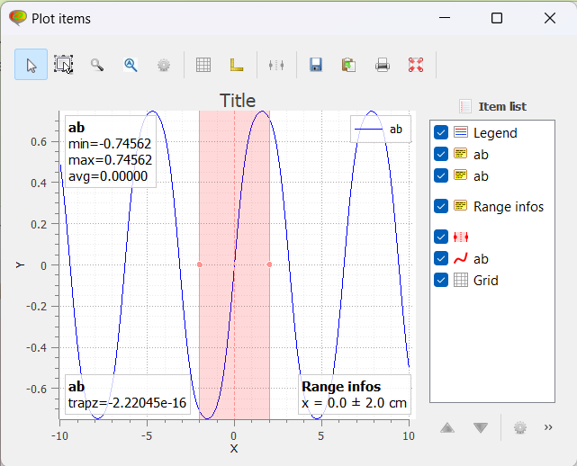

Curve fitting
-------------

.. literalinclude:: ../plotpy/tests/gui/test_fit.py
   :start-after: guitest:

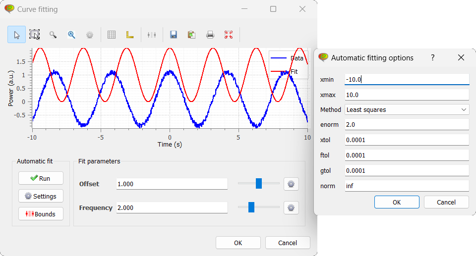

Image visualization
-------------------

Image contrast adjustment
~~~~~~~~~~~~~~~~~~~~~~~~~

.. literalinclude:: ../plotpy/tests/gui/test_contrast.py
   :start-after: guitest:

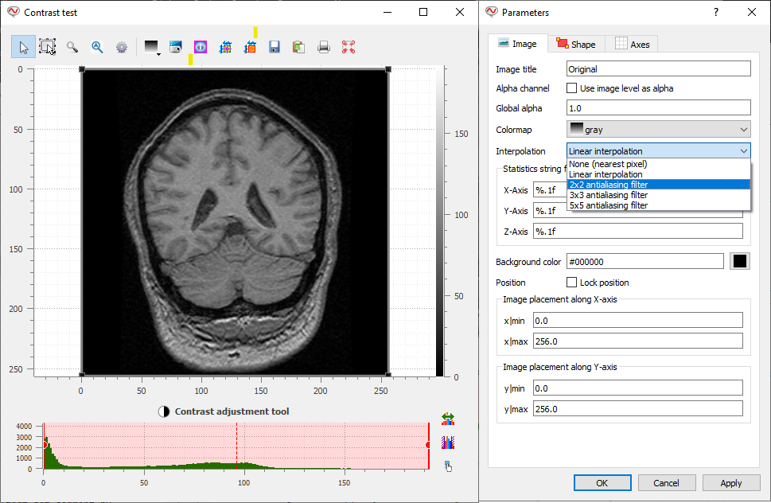

Image cross-sections
~~~~~~~~~~~~~~~~~~~~

.. literalinclude:: ../plotpy/tests/gui/test_cross_section.py
   :start-after: guitest:

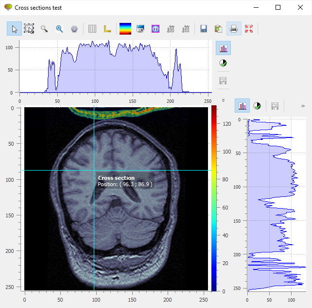

Transformable images
~~~~~~~~~~~~~~~~~~~~

Affine transforms example on 3000x3000 images (real-time transforms):

.. literalinclude:: ../plotpy/tests/gui/test_transform.py
   :start-after: guitest:

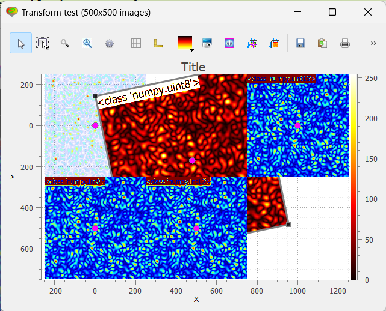

Image rectangular filter
~~~~~~~~~~~~~~~~~~~~~~~~

.. literalinclude:: ../plotpy/tests/gui/test_imagefilter.py
   :start-after: guitest:

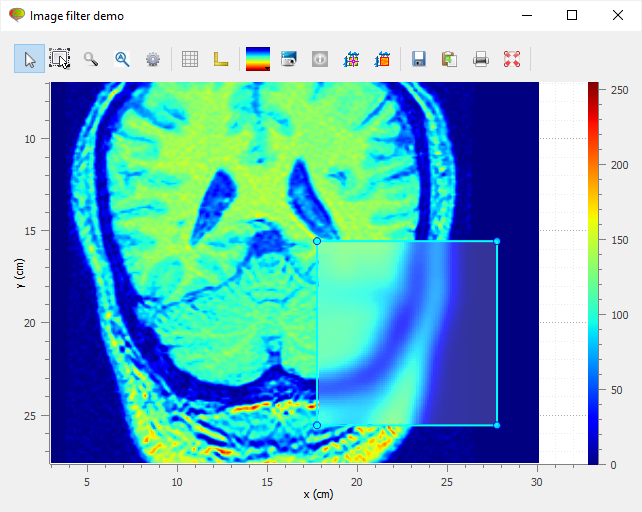

Histograms
----------

2-D histogram
~~~~~~~~~~~~~

.. literalinclude:: ../plotpy/tests/gui/test_hist2d.py
   :start-after: guitest:

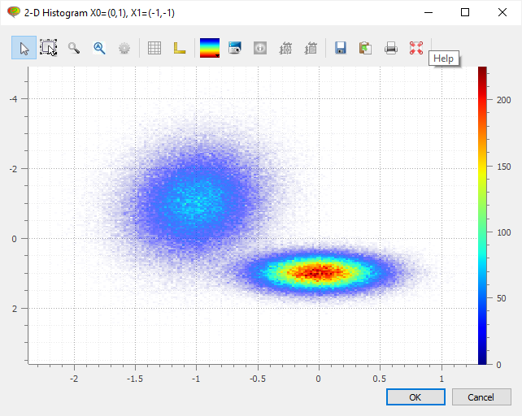

Other examples
--------------

Dot Array Demo
~~~~~~~~~~~~~~

.. literalinclude:: ../plotpy/tests/gui/test_dotarraydemo.py
   :start-after: guitest:

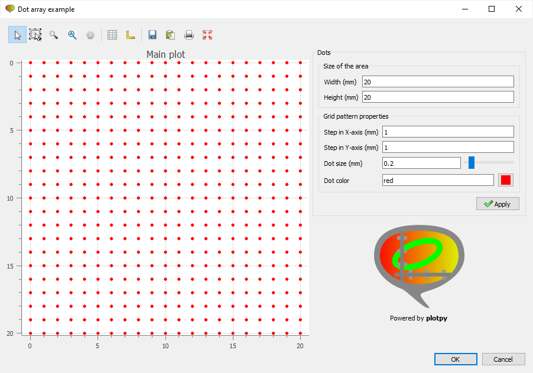

Image plot tools
~~~~~~~~~~~~~~~~

.. literalinclude:: ../plotpy/tests/gui/test_image_plot_tools.py
   :start-after: guitest:

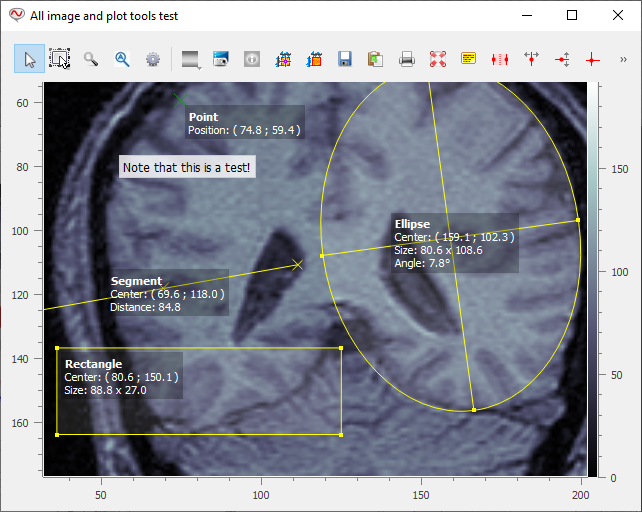

Real-time Mandelbrot plotting
~~~~~~~~~~~~~~~~~~~~~~~~~~~~~

.. literalinclude:: ../plotpy/tests/gui/test_mandelbrot.py
   :start-after: guitest:

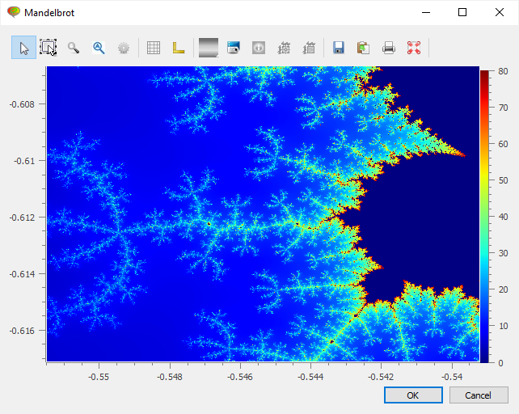

Simple application
~~~~~~~~~~~~~~~~~~

.. literalinclude:: ../plotpy/tests/gui/test_simple_window.py
   :start-after: guitest:

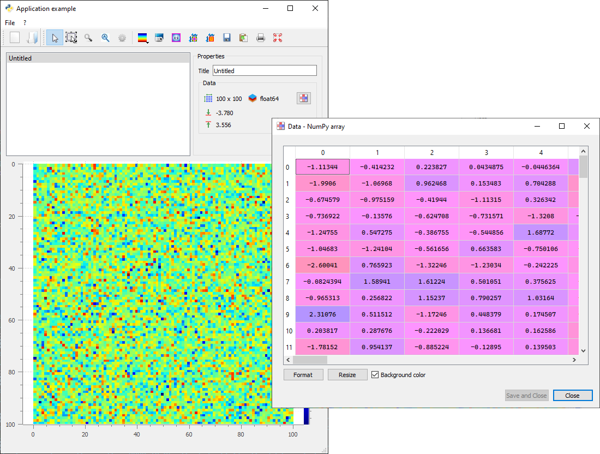
