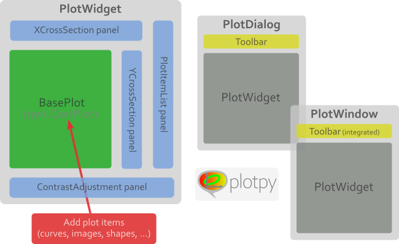

Features
========

A :mod:`plotpy`-based plotting widget may be constructed using one of the following
methods:

* *Interactive mode*: when manipulating and visualizing data in an interactive
  Python or IPython interpreter, the :py:mod`.pyplot` module provide
  the easiest way to plot curves, show images and more. Syntax is similar
  to MATLAB's, thus very easy to learn and to use interactively.

* *Script mode*: when manipulating and visualizing data using a script, the
  :py:mod`.pyplot` module is still a good choice as long as you don't
  need to customize the figure graphical user interface (GUI) layout.
  However, if you want to add other widgets to the GUI, like menus, buttons
  and so on, you should rather use plotting widget classes instead of
  the `pyplot` helper functions.

There are two kinds of plotting widgets defined in :mod:`plotpy`:

* low-level plotting widget: :py:class:`.plot.base.BasePlot`

* high-level plotting widgets (ready-to-use widgets with integrated tools
  and panels): :py:class:`.plot.PlotWidget` and corresponding dialog box
  :py:class:`.plot.PlotDialog` and window
  :py:class:`.plot.PlotWindow`

Plot widgets with integrated plot manager:

.. seealso::

    :ref:`items`
        Plot items: curves, images, markers, etc.

    :ref:`plot`
        Ready-to-use curve and image plotting widgets and dialog boxes

.. toctree::
   :maxdepth: 2
   :caption: Contents:

   plot/index
   items/index
   tools/index
   styles/index
   panels/index
   colormapmanager
   fit
   pyplot
   resizedialog
   rotatecrop
   fliprotate
   selectdialog
   imagefile
   io
   signals
   mathutils/index
