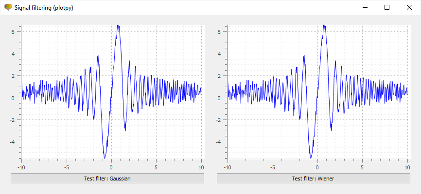

Examples
--------

Using :class:`.PlotWidget`
^^^^^^^^^^^^^^^^^^^^^^^^^^

The following example shows how to use the :class:`.PlotWidget` class to create
a simple plot with a curve and a filtering tool. In this example, the plot
manager (see :class:`.PlotManager`) is not used, at least not directly:
the plot manager is integrated in the :class:`.PlotWidget` class.

.. literalinclude:: ../../../plotpy/tests/widgets/test_filtertest1.py
   :start-after: guitest:

Using a plot manager
^^^^^^^^^^^^^^^^^^^^

Even if this simple example does not justify the use of the :class:`.PlotManager`
(this is an unnecessary complication here), it shows how to use it. In more complex
applications, using the :class:`.PlotManager` allows to design highly versatile
graphical user interfaces.

.. literalinclude:: ../../../plotpy/tests/widgets/test_filtertest2.py
   :start-after: guitest:

.. image:: ../../images/screenshots/filtertest2.png
