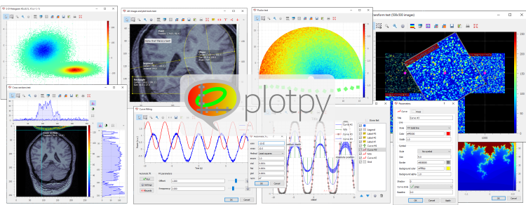

Welcome to :mod:`plotpy`'s documentation!
=========================================

Based on `PythonQwt` (plotting widgets for Python-Qt graphical user
interfaces) and on the scientific modules `NumPy` and `SciPy`, :mod:`plotpy` is a
Python library providing efficient 2D data-plotting features (curve/image
visualization and related tools) for interactive computing and signal/image
processing application development.

    A panorama of :mod:`plotpy`'s features.

External resources:

* Python Package Index: `PyPI`_

* Bug reports and feature requests: `GitHub`_

.. _PyPI: https://pypi.python.org/pypi/plotpy
.. _GitHub: https://codra-ingenierie-informatique.github.io/plotpy/

.. module:: plotpy

Table of contents
-----------------

.. toctree::
   :maxdepth: 2

   intro/index
   features/index
   dev/index

* :ref:`genindex`
